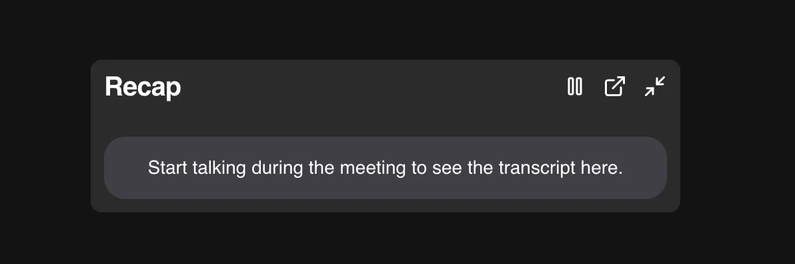

# Recap

An AI meeting assistant for Google Meet — packaged as a lightweight Chrome extension that captures live captions, automatically generates summaries, and lets you ask questions about any past meeting.

Built with **React**, **TypeScript**, and **Manifest V3** on the extension/dashboard side, with a **Node/Express + PostgreSQL (pgvector) + Gemini** backend powering summaries and retrieval-augmented Q&A.

🎥 [Watch the demo](https://www.youtube.com/watch?v=Qwp7rCgvSPI)

## Features

- Auto-appears as a draggable widget when you join a Google Meet call
- Transcribes live captions from all participants in real time
- Pause and resume transcription anytime
- Minimize the widget — transcription continues in the background
- Persists per-meeting captions, so you can continue or start fresh if you drop off a call
- Auto-generates an AI meeting summary (overview, detailed breakdown, next steps) once a call ends
- Ask AI — query any past meeting and get answers grounded in its actual transcript via a RAG pipeline
- Built-in dashboard to browse past meetings, view transcripts, and see details like date, duration, speakers, and caption count

## Tech Stack

- React, TypeScript, Chrome Extension Manifest V3
- Node.js, Express
- PostgreSQL, pgvector
- Google Gemini API (summaries, embeddings, RAG)
- Firebase Authentication

## Roadmap

- Search across all past meetings at once (cross-meeting semantic search)

## Installation

1. Clone this repo
2. Run `npm install`
3. Run `npm run build`
4. Load the `dist` folder into Chrome via `chrome://extensions` → **Load unpacked**

## License

MIT
